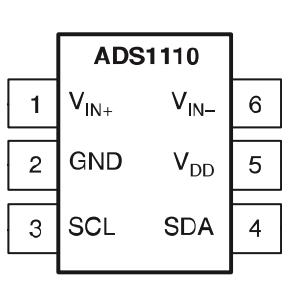

# ADS1110 DRIVER

[](http://www.atmel.com/products/microcontrollers/avr/)
&nbsp;&nbsp;&nbsp;&nbsp;&nbsp;&nbsp;&nbsp;&nbsp;&nbsp;&nbsp;
[](http://semver.org/)
&nbsp;&nbsp;&nbsp;&nbsp;&nbsp;&nbsp;&nbsp;&nbsp;&nbsp;&nbsp;
[](https://cadsoft.io/)
&nbsp;&nbsp;&nbsp;&nbsp;&nbsp;&nbsp;&nbsp;&nbsp;&nbsp;&nbsp;
[](https://opensource.org/licenses/MIT)

The ADS1110 is a 16-Bit Single-Channel (Single-Ended or Differential) ADC with Onboard Reference (2.048V), PGA & HW I2C capabilities.

This library contains a complete driver for the ADS1110 offering full control over its Configuration Settings, as well as the ability to recieve raw data, voltage readings (in mV, to avoid floating point math) or percentage readings in either Single-Shot or Continuous mode.



Source: [ADS1110 DATASHEET](http://www.ti.com/lit/ds/symlink/ads1110.pdf)

## Repository Contents

- **ADS1110.h** - Library Header file.
- **ADS1110.cpp** - Library Compilation.
- **/utility** 
  - **ADS1110InfoStr.h** - Header file containing a functional extention of the library to include generating printable information String (see Note #5 below).
  - **ADS1110ComStr.h** - Header file containing a functional extention of the library to include generating a printable I2C Communication Result String (see Note #6 below).
  - **ADS1110_PString.h** - Header file for PString class (lighter alternative to String class) 
  - **ADS1110_PString.cpp** - Compilation file for PString class (lighter alternative to String class) 
- **/examples**   
  - **/ADS1110_Test**
    - **ADS1110_Test.ino** - A basic sketch for testing whether the ADS1110 is hooked-up and operating correctly.
  - **/ADS1110_Usage**
    - **ADS1110_Usage.ino** - A much more extensive sketch offering a complete usage illustration, as well as a rubust testing mechanism.
  - **/ADS1110_Info** 
    - **ADS1110_Info.ino** - A short sketch showing how to generate a Printable Device Information String of the ADS1110's current settings (i.e. Configuration, Limit &anp; Hysteresis registers, etc.).
  - **/ADS1110_I2C_Status**
    - **ADS1110_I2C_Status.ino** - A short sketch for verifying I2C communication has been established between the controller and the ADS1110.
- **/extras**
  - **License.txt** - A cope of the end-user license agreement.  
  - **/eagle**
    - **ADS1110.sch** - Schematic file for the ADS1110 breakout board.
    - **ADS1110.brd** - Board layout file for the ADS1110 breakout board.
  - **/images**
    - **ads1110_pinout.png** - Pinout image of the ADS1110.
- **keywords.txt** - Keywords for this library which will be highlighted in sketches within the Arduino IDE. 
- **library.properties** - General library properties for the Arduino's IDE (>1.5) Library Package Manager.
- **README.md** - The readme file for this library.
- **library.json** - JSON file for the Arduino's IDE (>1.5) Package Manager.

## HOOK-UP

* __PIN 1 (Vin+)__ - Connect Vin+ to voltage source to be measured
* __PIN 2 (GND)__ - Connect GND to Arduino GND
* __PIN 3 (SCL)__ - Connect to Arduino PIN A5 with a 2K2 pull-up resistor
* __PIN 4 (SDA)__ - Connect to the Arduino's PIN A5 with a 2K2 pull-up resistor
* __PIN 5 (VCC)__ - Connect VCC to Arduino 5V output
* __PIN 6 (Vin-)__ - Connect Vin- either to Arduino GND (for Single-Ended voltage readings ranging 0-2.048V) or to an external 2.048V reference source (for Single-Ended voltage readings ranging 0-4.096V) or to 'negative' input (for differential voltage readings between positive and 'negative' inputs).
* __DECOUPING__: Connect a 0.1uF Ceramic Capacitor between the ADS1110's VCC &amp; GND PINS

>__Note__: The 'negative' of input Vin- is put in brackets here because it actually differential in nature and not a so-called real negative voltage - 
that is, it's negative only with relation to the positive input side of Vin+.

## GENERAL NOTES

1) __I2C Communications Library Dependency__

This library depends on the Arduino IDE's native '[Wire](https://github.com/arduino/Arduino/tree/master/hardware/arduino/avr/libraries/Wire)' library for I2C communication between the Arduino (Master) and the ADS1110 (Slave). 

2) __Dangers of GAIN Setting__

As I've managed to fry 2 ADS1110 ICs by changing the GAIN settings from the default x1 to another value, I've decided to stay away from this particular setting and not to include it in the full usage/testing sketch. That said, the library does contain the relevant functions for getting/setting the GAIN, however, make sure you know what you're doing when fiddling with this as you may damage your device.

3) __Voltage Reference Settings__

To get the correct __Raw Data Reading__/__Voltage Readings__/__Percentage Readings__, it is crucial to have the __Voltage Reference (Vref)__ setting defined correctly (i.e. INTERNAL / EXTERNAL). This is done on the basis of the physical hookup of the ADS1110's pin Vin- (namely: INTERNAL if this pin goes to GND, or EXTERNAL if it goes to an 2.048V external source. The default is GND connection &amp; an INTERNAL settings definition).  

4) __Sample Rate &amp; Resolution Interdependence__

The ADS1110's __Sample Rate__ and __Resolution__ settings are interdependent, that is, setting the value of one will automatically cause the other to change accordingly (15_SPS = 16-BIT / 30_SPS = 15-BIT / 60_SPS = 14-BIT / 240_SPS = 12-BIT).  

5) __Device Information String__

It possible to extend the ADS1110 Library to include a function for generating a printable device information string showing all the relevant details about the devices current Configuration, Limit & Hysteresis settings. As the additional functionality comes at the cost of increased memory footprint, it was implemented as an optional add-on rather than added directly to the core ADS1110 Library. See the [ADS1110_Info](https://github.com/nadavmatalon/ADS1110/blob/master/examples/ADS1110_Info/ADS1110_Info.ino) example sketch for detailed explanation and an actual usage demo.

6) __Device I2C Communications String__

It is also possible to extend the ADS1110 Library to include a function for generating a printable I2C Communications string showing the result of each I2C transaction in a human-friendly way, something that may be useful, for example, during debugging sessions. As the additional functionality comes at the cost of increased memory footprint, it was implemented as an optional add-on rather than added directly to the core ADS1110 Library. See the [ADS1110_I2C_Status](https://github.com/nadavmatalon/ADS1110/blob/master/examples/ADS1110_I2C_Status/ADS1110_I2C_Status.ino) example sketch for detailed explanation and an actual usage demo.

## I2C ADDRESSES

Each ADS1110 has 1 of 8 possible I2C addresses (factory hardwired &amp; recognized by its specific part number & top marking on the package itself):

| PART NO.  | BIN     | HEX  | DEC | MARKING |
|-----------|---------|------|-----|---------|
| ADS1110A0 | 1001000 | 0x48 | 72  | ED0     |
| ADS1110A1 | 1001001 | 0x49 | 73  | ED1     |
| ADS1110A2 | 1001010 | 0x4A | 74  | ED2     |
| ADS1110A3 | 1001011 | 0x4B | 75  | ED3     |
| ADS1110A4 | 1001100 | 0x4C | 76  | ED4     |
| ADS1110A5 | 1001101 | 0x4D | 77  | ED5     |
| ADS1110A6 | 1001110 | 0x4E | 78  | ED6     |
| ADS1110A7 | 1001111 | 0x4F | 79  | ED7     |


## LIBRARY INSTALLATION & SETUP

Begin by installing the library either by using the Arduino IDE's Installation Wizard (Arduino Version >1.5) or simply download the library's ZIP folder from GITHUB, extract it, and copy the extraxcted folder to your Arduino 'libraries' folder.

Next, include the library at the top of the sketch as follows:

```
#include "ADS1110.h"
```

At this point you can construct a new ADS1110 object(s) by using the following command (at the top of the sketch after the 'include' line):

```
ADS1110 device_name(device_address);
```

>Replace '__device_name__' with a name of your choice. Also, make sure to replace the variable '__device_address__' with 
the specific I2C address of your device if needed (see I2C ADDRESSES section above).

Next, make sure to inlude an instruction for initializing the I2C Bus for the [Wire](https://github.com/arduino/Arduino/tree/master/hardware/arduino/avr/libraries/Wire) Library, as follows:

(There's no need to include the [Wire](https://github.com/arduino/Arduino/tree/master/hardware/arduino/avr/libraries/Wire) Library at the top of the sketch as it's already included by the present library)

```
void setup() {
    Wire.begin();
    // ...other setup code...
}
```

## LIBRARY FUNCTIONS

With the library installed &amp; included in the sketch, and an ADS1110 object initiallized, the following functions are available (see the usage example sketch for a detailed implementation):

__Note About Methods' Return Values:__  
All 'get' methods return some sort of value (e.g. getGain(), getMode() etc.), while all 'set' methods return nothing. Nevertheless, ALL methods implicitly update the library's __I2C _comBuffer__ (=communication buffer) after each I2C transmission. The reason for this functional design is to maintain structural coherance between the 'get' and 'set' methods. As 'get' methods cannot return both the desired value and the I2C transmission's result simultaniously. Consequently, if the relevant value hasn't been obtained by a particular 'get' method, the user can simply check the content of the _comBuffer to see what error occured. Similarly, it is possible to check if a particular setting has been successfully applied via a 'set' method either by preforming the corresponding 'get' method or by checking the content of the _comBuffer (0 indicates a successful transmission, 1-6 indicate an error as listed below). 

__ping();__                                    
Parameters:&nbsp;&nbsp;&nbsp;None  
Description:&nbsp;&nbsp;&nbsp;Searches for the ADS1110 at the pre-defined I2C Bus address &amp; returns byte with the relevant success/error code, as follows:  
0  ...  Success (no error)  
1  ...  Buffer overflow  
2  ...  Address sent, NACK received  
3  ...  Data send, NACK received  
4  ...  Other error (lost bus arbitration, bus error, etc.)  
5  ...  Timed-out while trying to become Bus Master  
6  ...  Timed-out while waiting for data to be sent  
\>6 ... Unlisted error (potential future implementation/s)<br>
Returns:&nbsp;&nbsp;&nbsp;&nbsp;&nbsp;&nbsp;&nbsp;&nbsp;&nbsp;byte  
  
__getGain();__  
Parameters:&nbsp;&nbsp;&nbsp;None  
Description:&nbsp;&nbsp;&nbsp;Gets the current Gain settings (x1 [Default] / x2 / x4 / x8)  
Returns:&nbsp;&nbsp;&nbsp;&nbsp;&nbsp;&nbsp;&nbsp;&nbsp;Byte  
  
__getSampleRate();__  
Parameters:&nbsp;&nbsp;&nbsp;None  
Description:&nbsp;&nbsp;&nbsp;Gets the current Sample Rate settings  (15 SPS [Default] / 30 SPS / 60 SPS / 240 SPS)  
Returns:&nbsp;&nbsp;&nbsp;&nbsp;&nbsp;&nbsp;&nbsp;&nbsp;Byte  
  
__getConMode();__  
Parameters:&nbsp;&nbsp;&nbsp;None  
Description:&nbsp;&nbsp;&nbsp;Gets the current Conversion Mode settings (0 = CONTINUOUS [Default] / 1 = SINGLE-SHOT)  
Returns:&nbsp;&nbsp;&nbsp;&nbsp;&nbsp;&nbsp;&nbsp;&nbsp;Byte  
  
__getRes();__  
Parameters:&nbsp;&nbsp;&nbsp;None  
Description:&nbsp;&nbsp;&nbsp;Gets the current Resolution settings (12-BIT / 14-BIT / 15-BIT / 16-BIT [Default])  
Returns:&nbsp;&nbsp;&nbsp;&nbsp;&nbsp;&nbsp;&nbsp;&nbsp;Byte  
  
__getVref();__  
Parameters:&nbsp;&nbsp;&nbsp;None  
Description:&nbsp;&nbsp;&nbsp;Gets the current Voltage Reference mode (0 = INTERNAL [Default] / 2048 = EXTERNAL)  
Returns:&nbsp;&nbsp;&nbsp;&nbsp;&nbsp;&nbsp;&nbsp;&nbsp;Int  
  
__setGain();__  
Parameters:&nbsp;&nbsp;&nbsp;GAIN_1 / GAIN_2 /GAIN_4 / GAIN_8  
Description:&nbsp;&nbsp;&nbsp;Sets the Gain (x1 / x2 / x4 / x8)  
Returns:&nbsp;&nbsp;&nbsp;&nbsp;&nbsp;&nbsp;&nbsp;&nbsp;None  
  
__setSampleRate();__  
Parameters:&nbsp;&nbsp;&nbsp;SPS_15 / SPS_30 / SPS_60 / SPS_240  
Description:&nbsp;&nbsp;&nbsp;Sets the Sample Rate in Samples per Second (15 SPS / 30 SPS / 60 SPS / 240 SPS)  
Returns:&nbsp;&nbsp;&nbsp;&nbsp;&nbsp;&nbsp;&nbsp;&nbsp;None  
  
__setConMode();__  
Parameters:&nbsp;&nbsp;&nbsp;CONT / SINGLE  
Description:&nbsp;&nbsp;&nbsp;Sets the Conversion Mode (CONTINUOUS / SINGLE-SHOT)  
Returns:&nbsp;&nbsp;&nbsp;&nbsp;&nbsp;&nbsp;&nbsp;&nbsp;None  
  
__setRes();__  
Parameters:&nbsp;&nbsp;&nbsp;12_BIT / 14_BIT / 15_BIT / 16_BIT  
Description:&nbsp;&nbsp;&nbsp;Sets the Resolution level ( 12-BIT / 14-BIT / 15-BIT / 16-BIT)  
Returns:&nbsp;&nbsp;&nbsp;&nbsp;&nbsp;&nbsp;&nbsp;&nbsp;None  
  
__setVref();__  
Parameters:&nbsp;&nbsp;&nbsp;INT_REF / EXT_REF  
Description:&nbsp;&nbsp;&nbsp;Sets the Voltage reference mode (INTERNAL / EXTERNAL)  
This setting needs to be set according to the hardware hookup of the ADS1110 Pin Vin-, namely: If the Vin- pin is connected to GND, then the Voltage Reference (Vref) should be set to 'INTERNAL'. This, in turn, provides a voltage reading range of 0-2048mV. Alternatively, the Vin- pin may be connected to an external 2.048V source, in which case the Voltage Referece settings should be set to 'EXTERNAL'. The latter hookup & setting gives an extended voltage reading range of 0-4096mV.  
Returns:&nbsp;&nbsp;&nbsp;&nbsp;&nbsp;&nbsp;&nbsp;&nbsp;None  
  
__reset();__  
Parameters:&nbsp;&nbsp;&nbsp;None  
Description:&nbsp;&nbsp;&nbsp;Resets the Configuration register to its default settings  
Returns:&nbsp;&nbsp;&nbsp;&nbsp;&nbsp;&nbsp;&nbsp;&nbsp;None  
  
__getData();__  
Parameters:&nbsp;&nbsp;&nbsp;None  
Description:&nbsp;&nbsp;&nbsp;Gets the latest raw ADC reading  
Returns:&nbsp;&nbsp;&nbsp;&nbsp;&nbsp;&nbsp;&nbsp;&nbsp;Int  
  
__getVolt();__  
Parameters:&nbsp;&nbsp;&nbsp;None  
Description:&nbsp;&nbsp;&nbsp;Gets the latest ADC reading (in mV, to avoid floating point calculations)  
Returns:&nbsp;&nbsp;&nbsp;&nbsp;&nbsp;&nbsp;&nbsp;&nbsp;Int  
  
__getPercent();__  
Parameters:&nbsp;&nbsp;&nbsp;None  
Description:&nbsp;&nbsp;&nbsp;Gets the latest ADC reading in Percentage format (0-100%)  
Returns:&nbsp;&nbsp;&nbsp;&nbsp;&nbsp;&nbsp;&nbsp;&nbsp;Byte  
  
__getComResult();__  
Parameters:&nbsp;&nbsp;&nbsp;None  
Description:&nbsp;&nbsp;Returns the latest I2C Communication result code (see Success/Error codes above)  
Returns:&nbsp;&nbsp;&nbsp;&nbsp;&nbsp;&nbsp;&nbsp;&nbsp;byte  
  
__Destructor__  
If you want to destruct an instantiated ADS1110 object, you can use the following method to do so:  

```
~ADS1110 device_name();
```
>Replace '__device_name__' with the name of your ADS1110 device.

## Extended Functionality*

(* requires an additional '\#include' of the relevant *.h file as shown in the corresponding example sketches)  
  
__ADS1110ComStr();__  
Parameters:&nbsp;&nbsp;&nbsp;Name of an initialized ADS1110 instance  
Description:&nbsp;&nbsp;Returns printable string containing human-friendly information about the device's latest I2C communication result  
Returns:&nbsp;&nbsp;&nbsp;&nbsp;&nbsp;&nbsp;&nbsp;&nbsp;PString  
  
__ADS1110InfoStr();__  
Parameters:&nbsp;&nbsp;&nbsp;Name of an initialized ADS1110 instance  
Description:&nbsp;&nbsp;Returns printable string containing detailed information about the device's current settings  
Returns:&nbsp;&nbsp;&nbsp;&nbsp;&nbsp;&nbsp;&nbsp;&nbsp;PString  

## RUNNING THE EXAMPLE SKETCHES
  
1) Start the Arduino IDE and open the relevant example sketch  
2) Hook-up the ADS1110 to the Arduino as explained in the sketch's notes   
3) Upload the sketch to the Arduino  
4) Open the Serial Communications Window (make sure the baud-rate is set to 9600 or change it in the sketch to match your Serial Port's buad-rate)  
  
## BUG REPORTS
  
Please report any issues/bugs/suggestions at the [Issues](https://github.com/nadavmatalon/ADS1110/issues) section of this Github repository.
  
## TODO
  
* __CORE LIBRARY__: Add running average functionality  
  
## VERSION HISTORY

__Ver. 1.0.0__ - First release (26.9.16)  
__Ver. 1.1.0__ - Major code refactoring (10.10.16)  
__Ver. 1.2.0__ - Added namespaces to prevent conflicts with other libraries (15.10.16)  
__Ver. 1.3.0__ - Switched from 'WSWire' library to 'Wire' library for I2C communications (24.10.16)

## LICENSE

[The MIT License (MIT)](https://opensource.org/licenses/MIT)
Copyright (c) 2016 Nadav Matalon

Permission is hereby granted, free of charge, to any person obtaining a copy of this software and associated documentation files (the "Software"), to deal in the Software without restriction, including without limitation the rights to use, copy, modify, merge, publish, distribute, sublicense, and/or sell copies of the Software, and to permit persons to whom the Software is furnished to do so, subject to the following conditions:

The above copyright notice and this permission notice shall be included in all copies or substantial portions of the Software.

THE SOFTWARE IS PROVIDED "AS IS", WITHOUT WARRANTY OF ANY KIND, EXPRESS OR IMPLIED, INCLUDING BUT NOT LIMITED TO THE WARRANTIES OF MERCHANTABILITY, FITNESS FOR A PARTICULAR PURPOSE AND NONINFRINGEMENT. IN NO EVENT SHALL THE AUTHORS OR COPYRIGHT HOLDERS BE LIABLE FOR ANY CLAIM, DAMAGES OR OTHER LIABILITY, WHETHER IN AN ACTION OF CONTRACT, TORT OR OTHERWISE, ARISING FROM, OUT OF OR IN CONNECTION WITH THE SOFTWARE OR THE USE OR OTHER DEALINGS IN THE SOFTWARE.

